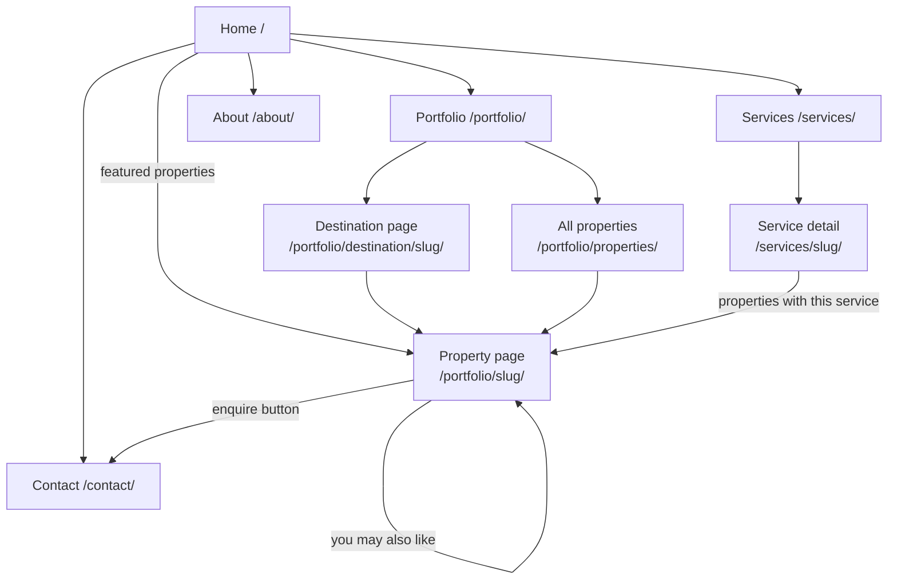

# Oliverde — Property Management Website

Oliverde is a bespoke property management website for a boutique company caring for homeowners' properties across Tuscany, Umbria, and Lazio. The site showcases the portfolio of managed properties by destination, outlines Oliverde's services, and lets prospective and existing clients get in touch.

[Live link — not yet deployed]

# Contents

- [Oliverde — Property Management Website](#oliverde--property-management-website)
- [Contents](#contents)
- [User Experience (UX)](#user-experience-ux)
    - [Ideal Client](#ideal-client)
- [Planning](#planning)
- [Design](#design)
    - [Site Map](#site-map)
    - [App Architecture](#app-architecture)
    - [Theme](#theme)
    - [Typography](#typography)
    - [Iconography](#iconography)
- [Languages Used](#languages-used)
- [Frameworks, Libraries \& Tools Used](#frameworks-libraries--tools-used)
- [Features](#features)
  - [Home Page](#home-page)
  - [Portfolio](#portfolio)
  - [Services](#services)
  - [About](#about)
  - [Contact](#contact)
  - [Site-wide](#site-wide)
- [Data Models](#data-models)
- [Deployment](#deployment)
- [Testing](#testing)
- [Known Limitations \& Roadmap](#known-limitations--roadmap)
- [Credits](#credits)
  - [Content](#content)
  - [Development](#development)

# User Experience (UX)

### Ideal Client

The ideal client for this business is:

- An international homeowner — typically based in the US, UK or elsewhere in Europe — who owns a property in Tuscany, Umbria, or Lazio but doesn't live there full-time
- Someone who visits seasonally or a few times a year, rather than living on-site
- Values discretion, personal relationships, and craftsmanship over the lowest price
- Wants a single trusted point of contact rather than personally coordinating cleaners, gardeners, and contractors from abroad

A full persona profile for this client (James Calloway) was developed separately using a design-thinking persona template, covering goals, pain points, and likes/dislikes in more detail.

[Client Persona Profile](staticfiles/README_docs/oliverde_client_persona.pdf "client_persona")

Visitors to the Oliverde website are seeking:

- Reassurance that their property will be cared for to the same standard they'd expect themselves
- A clear view of the actual homes Oliverde manages, by destination
- An understanding of exactly what's included in property management, restoration oversight, and guest services
- An easy, low-friction way to get in touch without a hard sales push

This website addresses those goals through a portfolio structured around real destinations and properties (not generic stock imagery), a full breakdown of each service with its own page, and a contact form designed to feel like a personal introduction rather than a lead-capture funnel.

[Back to top](#contents)

# Planning

Development was iterative and content-led rather than following a fixed spec upfront: the site's structure (Portfolio, Services, About, Contact) was built out page by page, informed by design comps provided by the client and refined through direct feedback (for example, moving from a generic circle-icon system to a custom single-line "sprig" motif, and removing an early "Client Login" concept in favor of admin-only access for now).

A content-collection template (Word document) was built to gather final copy, images, and structured data (destinations, properties, services, testimonials) directly with the client, rather than guessing placeholder content.

[Back to top](#contents)

# Design

### Site Map

### App Architecture

The project is split into apps by what owns the data, not by what the navigation currently calls something — see [`ARCHITECTURE.md`](ARCHITECTURE.md) for the full diagram and reasoning. In short:

- **`accounts`** — custom `User` model (admin/client role field, no client-facing login built yet)
- **`portfolio`** — owns all real data: `Destination`, `Property`, `PropertyImage`, `Service`, `ServiceFeature`, `Testimonial`
- **`core`** — site-wide pages that read from `portfolio` (Home, About, Contact) and the shared nav context processor
- **`services`** — a thin, display-only app that reads `Service` data from `portfolio`

### Theme

| Token | Hex |
|---|---|
| Cream (background) | `#F7F4EC` |
| Stone (alt background) | `#EDE7D9` |
| Olive 900 (deep) | `#232A17` |
| Olive 700 (mid) | `#47542C` |
| Olive 400 (muted) | `#8B9468` |
| Charcoal (text) | `#23221E` |
| Taupe (secondary text) | `#6E6759` |
| Rust (single accent) | `#A8592E` |

The palette is deliberately restrained — olive, cream, and stone throughout, with rust used sparingly as the only accent color (hover states, one CTA button, icon strokes) rather than spread across the page.

### Typography

- **Cormorant Garamond** — serif, used for headings and display moments, including italic for emphasis
- **Inter** — sans-serif, used for navigation, labels, and body copy

Both sourced from Google Fonts.

### Iconography

A custom single-line "sprig" (olive branch) SVG icon is used consistently across the site in place of generic circle-outline icons, tying the icon system directly to the brand's olive-grove imagery rather than a default template pattern.

[Back to top](#contents)

# Languages Used

- Python
- HTML (Django templates)
- CSS
- JavaScript

[Back to top](#contents)

# Frameworks, Libraries & Tools Used

- [**Django**](https://www.djangoproject.com/) — web framework
- [**PostgreSQL**](https://www.postgresql.org/) — database
- [**Cloudinary**](https://cloudinary.com/) + [**django-cloudinary-storage**](https://pypi.org/project/django-cloudinary-storage/) — media storage
- [**python-dotenv**](https://pypi.org/project/python-dotenv/) — local environment variable management
- [**Heroku**](https://www.heroku.com/) — planned hosting (not yet deployed)
- [**MailerSend**](https://www.mailersend.com/) — planned contact form email delivery (integration not yet connected — see [Known Limitations](#known-limitations--roadmap))
- [**Google Fonts**](https://fonts.google.com/) — Cormorant Garamond, Inter
- **Django admin** — used directly as the CMS (no separate CMS package such as Wagtail)
- **Git** & **GitHub** — version control
- **Visual Studio Code** — development environment
- **Mermaid** — architecture and site-map diagrams (this README, `ARCHITECTURE.md`)

[Back to top](#contents)

# Features

## Home Page

- Full-bleed hero with headline, subheading, and consultation CTA
- Stats banner (years active, portfolio value, specialists, regions)
- Three-pillar section ("Your Home, Protected" / "Your Guests, Welcomed" / "Your Investment, Maintained")
- Featured properties grid, pulled dynamically from properties marked `featured` in admin
- Services teaser grid, linking to each service's own detail page
- Founder section with a rotating testimonial carousel (auto-advances, with clickable dots) driven by testimonials marked `featured_on_homepage`
- "Why international owners choose Oliverde" band
- Consultation CTA band

## Portfolio

- **Portfolio landing page** — "Browse by Destination" grid (fully dynamic, driven by `Destination` records) plus a link through to all properties
- **Destination detail page** — hero, description, all published properties in that destination, and an optional destination-linked testimonial
- **Property detail page** — image gallery, icon-based quick facts (bedrooms/bathrooms/sleeps), the specific services tagged to that property, related properties in the same destination, and an "Enquire about this property" link through to Contact
- **All Properties page** — paginated grid of every published property

## Services

- **Services index page** — summary of all five services (Post-Purchase Set-Up, Property Maintenance, Restoration Management, Property Administration, Property Rental) with links to individual pages
- **Individual service detail pages** — full feature-bullet breakdown per service, plus properties that offer that specific service

## About

- Company story and local-expertise sections
- Summary team section (general roles rather than a fabricated named roster — see [Known Limitations](#known-limitations--roadmap))

## Contact

- Styled enquiry form (name, email, phone, enquiry type, message) with server-side validation and a success confirmation message
- Direct contact details (email, phone, regions served)

## Site-wide

- **Fully dynamic navigation** — the Portfolio and Services dropdown submenus are driven by a context processor querying the database on every page load, so adding, renaming, or removing a destination or service in admin updates the nav automatically with no template changes
- Responsive mobile navigation with an accordion-style submenu
- Django admin configured as a genuinely usable CMS: inline property image galleries, inline service feature bullets, filtering by destination/type/featured status

[Back to top](#contents)

# Data Models

Full model relationships are shown in the [App Architecture](#app-architecture) diagram above. In summary:

- `Destination` → many `Property`
- `Property` → many `PropertyImage`
- `Property` ↔ `Service` (many-to-many)
- `Service` → many `ServiceFeature`
- `Testimonial` optionally linked to a `Destination` or `Property`, with a `featured_on_homepage` flag

[Back to top](#contents)

# Deployment

*Not yet deployed. Planned deployment steps, based on the original project proposal:*

1. Create a Heroku app and attach a Heroku Postgres add-on
2. Set config vars: `SECRET_KEY`, `DATABASE_URL`, `CLOUDINARY_CLOUD_NAME`, `CLOUDINARY_API_KEY`, `CLOUDINARY_API_SECRET`, `MAILERSEND_API_KEY`
3. Set `DEBUG = False` and configure `ALLOWED_HOSTS` for the production domain
4. Run `collectstatic` and confirm static/media files resolve via Cloudinary
5. Configure SSL and DNS for the production domain
6. Connect the GitHub repository to Heroku for deployment

[Back to top](#contents)

# Testing

*Not yet formally tested. Planned before launch:*

- Manual click-through testing of every page and link
- Form validation testing on the Contact page (including the missing spam protection noted below)
- Responsive testing at key breakpoints (375px, 768px, 1024px, and desktop) — an initial CSS audit has been done, but not yet confirmed in-browser at every breakpoint
- HTML/CSS validation (W3C validators)
- Django system checks / `flake8`

[Back to top](#contents)

# Known Limitations & Roadmap

Being upfront about what isn't finished yet:

- **Contact form email is not actually connected** — the form validates and shows a success message, but MailerSend integration is stubbed out pending API credentials
- **No spam protection** on the contact form yet (no honeypot or CAPTCHA)
- **No video support** anywhere on the site — all media is images only
- **No client accounts** — the custom `User` model has a `role` field for this, but no client-facing login exists yet; only Django admin is used
- **About page team section** is a general summary, not individual named profiles with photos — that would need a small `TeamMember` model if wanted
- **Journal section** appears in early design comps but has not been built
- **No CMS beyond Django admin** — by design (no Wagtail), but worth noting for anyone expecting a page-builder-style editing experience

[Back to top](#contents)

# Credits

## Content

Property, destination, and service content provided directly by the client, Oliverde Property Management Services.

## Development

Designed and developed by Lilla Kavecsanszki, using Django.

[Back to top](#contents)