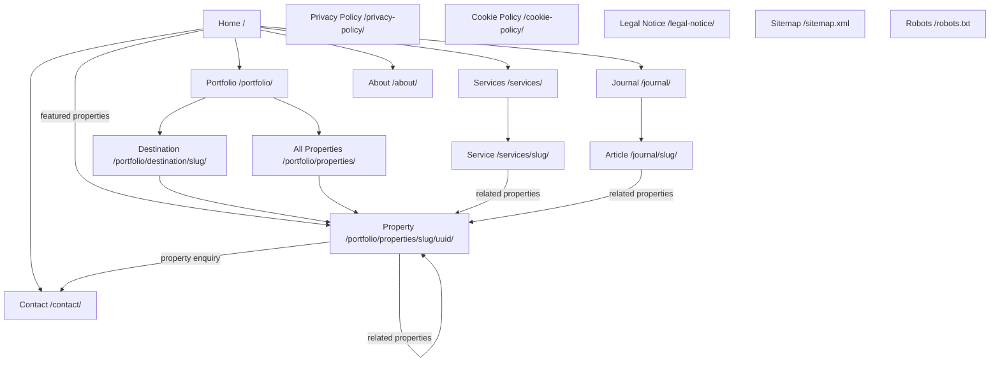

# Oliverde — Property Management Website

Oliverde is a bespoke property-management and editorial portfolio website for a boutique Italian company caring for exceptional homes across Tuscany, Umbria, and Lazio.

The platform presents Oliverde’s destinations, managed properties, services, journal content, testimonials, and enquiry experience through a custom Django application and administration system.

## Live Website

[View the live Heroku deployment](https://oliverde-property-management-2affa78894a3.herokuapp.com/)

The final Oliverde custom domain will be connected before the official public launch.

---

# Contents

- [Oliverde — Property Management Website](#oliverde--property-management-website)
  - [Live Website](#live-website)
- [Contents](#contents)
- [User Experience](#user-experience)
  - [Ideal Client](#ideal-client)
- [Planning](#planning)
- [Design](#design)
  - [Brand Identity](#brand-identity)
  - [Site Map](#site-map)
  - [Application Architecture](#application-architecture)
    - [`accounts`](#accounts)
    - [`portfolio`](#portfolio)
    - [`services`](#services)
    - [`journal`](#journal)
    - [`core`](#core)
    - [`config`](#config)
  - [Colour Palette](#colour-palette)
  - [Typography](#typography)
  - [Iconography](#iconography)
- [Languages](#languages)
- [Technology](#technology)
  - [Application](#application)
  - [Production](#production)
  - [Media](#media)
  - [Development](#development)
  - [Email](#email)
  - [Security](#security)
- [Features](#features)
  - [Home](#home)
  - [Portfolio](#portfolio-1)
  - [Destination Pages](#destination-pages)
  - [Property Pages](#property-pages)
    - [Property Gallery](#property-gallery)
  - [Services](#services-1)
  - [Journal](#journal-1)
  - [About](#about)
  - [Contact](#contact)
  - [Site-wide Features](#site-wide-features)
- [Data Models](#data-models)
  - [Destination](#destination)
  - [Property](#property)
  - [PropertyImage](#propertyimage)
  - [PropertyAmenity](#propertyamenity)
  - [Service](#service)
  - [ServiceFeature](#servicefeature)
  - [ServiceImage](#serviceimage)
  - [Testimonial](#testimonial)
  - [JournalPost](#journalpost)
  - [User](#user)
- [Privacy and Property Protection](#privacy-and-property-protection)
- [Administration](#administration)
- [SEO](#seo)
- [Accessibility](#accessibility)
- [Deployment](#deployment)
  - [Production Infrastructure](#production-infrastructure)
  - [Environment Variables](#environment-variables)
  - [Local Installation](#local-installation)
- [Testing](#testing)
- [Known Limitations](#known-limitations)
- [Roadmap](#roadmap)
- [Credits](#credits)
  - [Content](#content)
  - [Design and Development](#design-and-development)
  - [Photography and Assets](#photography-and-assets)

---

# User Experience

## Ideal Client

The principal client is an international homeowner who owns a property in Tuscany, Umbria, or Lazio but does not live there full-time.

They may be based in the United Kingdom, United States, elsewhere in Europe, or further abroad. They typically visit seasonally and need a trusted local team to oversee the property throughout the year.

The ideal Oliverde client:

- values discretion, personal relationships, and craftsmanship;
- wants a dependable local point of contact;
- expects proactive communication and transparent reporting;
- needs support coordinating cleaners, gardeners, pool teams, contractors, utilities, and administration;
- wants their home prepared perfectly for owner or guest arrivals;
- may require restoration, rental, concierge, or post-purchase support;
- values long-term stewardship over a low-cost transactional service.

Visitors to the Oliverde website are seeking:

- reassurance that their home will be protected and carefully maintained;
- evidence of the standard and range of properties Oliverde manages;
- a clear explanation of Oliverde’s services;
- regional knowledge of Tuscany, Umbria, and Lazio;
- a discreet and low-pressure way to enquire;
- confidence that the privacy of owners, guests, and properties is respected.

The website addresses these needs through an editorial property portfolio, destination-led navigation, detailed service pages, carefully controlled property information, and a personal consultation enquiry route.

[Back to top](#contents)

---

# Planning

Development followed an iterative, content-led process rather than a fixed template or purchased theme.

The site was designed and built as a bespoke Django application. Its structure evolved through repeated review of:

- Oliverde’s actual services and operational workflows;
- the properties and regions under management;
- client privacy requirements;
- luxury hospitality and architectural editorial references;
- responsive behaviour;
- accessibility;
- search-engine structure;
- content-management requirements;
- production deployment constraints.

The final primary navigation is:

- Home
- Portfolio
- Services
- Journal
- About
- Contact

The administration system was designed so that Oliverde can manage destinations, properties, services, galleries, amenities, testimonials, and journal articles without editing templates or source code.

[Back to top](#contents)

---

# Design

## Brand Identity

The Oliverde visual identity includes:

- bespoke Oliverde wordmark;
- “O” monogram with a subtle keyhole motif;
- favicon suite;
- restrained natural colour palette;
- self-hosted typography;
- botanical line illustrations;
- editorial property photography;
- branded social-sharing imagery;
- consistent visual treatment across website and supporting business assets.

The visual direction combines Italian architectural heritage with understated contemporary luxury.

## Site Map



## Application Architecture

The project is divided into Django apps according to responsibility.

### `accounts`

Owns the custom `User` model and role choices:

- Admin
- Property Manager
- Client

The project currently uses Django Admin rather than a public client portal.

### `portfolio`

Owns the core property-management content:

- `Destination`
- `Property`
- `PropertyImage`
- `PropertyAmenity`
- `Service`
- `ServiceFeature`
- `ServiceImage`
- `Testimonial`

### `services`

Provides the public service index and service detail views while reading service data from the `portfolio` app.

### `journal`

Owns journal articles, publishing controls, cover images, excerpts, rich-text content, related properties, pagination, and sitemap integration.

### `core`

Owns:

- homepage;
- about page;
- contact page and enquiry form;
- privacy policy;
- cookie policy;
- legal notice;
- custom error views;
- `robots.txt`;
- shared navigation context;
- site-wide context processors.

### `config`

Owns project-level configuration:

- Django settings;
- root URL routing;
- WSGI and ASGI configuration;
- sitemap classes;
- production database configuration.

## Colour Palette

| Token | Hex |
|---|---:|
| Cream | `#F7F4EC` |
| Stone | `#EDE7D9` |
| Olive 900 | `#232A17` |
| Olive 700 | `#47542C` |
| Olive 400 | `#8B9468` |
| Charcoal | `#23221E` |
| Taupe | `#6E6759` |
| Rust | `#A8592E` |

The palette is deliberately restrained. Olive, cream, stone, and charcoal establish the main visual system, while rust is used sparingly for emphasis and interaction.

## Typography

- **Cormorant Garamond** — headings, display copy, editorial quotations, and selected italic emphasis.
- **Inter** — navigation, labels, forms, metadata, and body copy.

The fonts are self-hosted from the project’s static files rather than loaded from an external font service.

## Iconography

The visual system includes:

- the Oliverde keyhole monogram;
- a custom single-line botanical sprig;
- lightweight property-fact icons;
- restrained gallery and navigation controls;
- minimal interface decoration.

[Back to top](#contents)

# Languages

- Python
- HTML
- Django Template Language
- CSS
- JavaScript
- SQL

[Back to top](#contents)

---

# Technology

## Application

- [Django 6](https://www.djangoproject.com/)
- [PostgreSQL](https://www.postgresql.org/)
- Django Admin
- Django Sitemaps Framework
- [django-ckeditor-5](https://pypi.org/project/django-ckeditor-5/)

## Production

- [Heroku](https://www.heroku.com/)
- Heroku-26 stack
- Heroku Postgres
- Gunicorn
- `dj-database-url`
- WhiteNoise
- Compressed Manifest Static Files Storage
- Heroku release-phase migrations

## Media

- [Cloudinary](https://cloudinary.com/)
- [django-cloudinary-storage](https://pypi.org/project/django-cloudinary-storage/)
- Pillow

## Development

- Git
- Private GitHub repository
- Visual Studio Code
- `python-dotenv`
- Mermaid
- PostgreSQL local development database

## Email

- Gmail SMTP
- Google App Password authentication

## Security

- Cloudflare Turnstile
- Django CSRF protection
- Database-backed cache rate limiting

[Back to top](#contents)

# Features

## Home

- Full-width editorial hero.
- Consultation CTA.
- Portfolio CTA.
- Company statistics.
- Introductory brand statement.
- Three service pillars.
- Dynamically selected featured properties.
- Dynamic services preview.
- Founder section.
- Rotating testimonials.
- Testimonial navigation controls.
- "Why international owners choose Oliverde" section.
- Final consultation CTA.
- Real Estate Agent structured data.

## Portfolio

- Portfolio landing page.
- Destination-led browsing.
- Dynamic destination cards.
- Featured properties.
- All-properties index.
- Destination filter.
- Property sorting.
- Pagination.
- Reset-filter control.
- Empty-results state.
- Privacy and discretion messaging.
- Privacy-safe public property titles.
- Published-property filtering.

## Destination Pages

- Destination cover image.
- Destination name and tagline.
- Destination introduction.
- Published property listings.
- Property type and bedroom metadata.
- Rental labels.
- Optional destination testimonial.
- Internal navigation back to the portfolio.

## Property Pages

- Privacy-safe public property identity.
- Random UUID-based public URL.
- Canonical redirect when an editorial slug changes.
- Cover image.
- Rental availability banner.
- Property description.
- Optional property facts.
- Bedroom count.
- Bathroom count.
- Guest capacity.
- Land size.
- Air-conditioning details.
- Pool and heated-pool information.
- Property amenities.
- Rental enquiry introduction.
- Property-specific enquiry link.
- Management services.
- Related properties.
- Published-property protection.

### Property Gallery

- Ordered property-image administration.
- Internal editorial image categories.
- Continuous public gallery presentation.
- Full-screen lightbox.
- Previous and next controls.
- Keyboard arrow navigation.
- Escape-to-close behaviour.
- Image caption.
- Image counter.
- Reduced-motion support.
- Responsive presentation.

## Services

- Services index.
- Individual service pages.
- Ordered service features.
- Ordered service image galleries.
- Editorial asymmetric gallery layout.
- Shared full-screen lightbox.
- Related properties.
- Consultation CTA.
- Sitemap integration.

The five core services are:

1. Post-Purchase Set-Up
2. Property Maintenance
3. Restoration Management
4. Property Administration
5. Property Rental

## Journal

- Journal index.
- Published-post filtering.
- Cover images.
- Article excerpts.
- Article detail pages.
- Rich-text content using CKEditor 5.
- Rich-text image upload URL.
- Related properties.
- Additional article recommendations.
- Pagination.
- Sitemap integration.
- SEO metadata structure.

## About

- Company introduction.
- Founder story.
- Oliverde values.
- Regional expertise.
- Service philosophy.
- Consultation CTA.
- Page metadata.

## Contact

- Public enquiry form
- Property-specific rental enquiries
- Name, email, phone, enquiry type and message fields
- International telephone validation
- Server-side validation
- Property UUID validation
- Rental-only property validation
- Cloudflare Turnstile protection
- Honeypot spam protection
- Cache-backed rate limiting
- Gmail SMTP notifications
- Database persistence
- Django Admin integration
- Accessible validation messages
- Loading state during submission
- Privacy Policy notice
- Direct email and telephone details
- Regions-served information

## Site-wide Features

- Responsive navigation.
- Dynamic Portfolio dropdown.
- Dynamic Services dropdown.
- Mobile accordion navigation.
- Active navigation states.
- Keyboard-accessible controls.
- Responsive footer.
- Legal-page links.
- Self-hosted fonts.
- Custom favicon suite.
- Custom 404 page.
- Custom 500 page.
- Default Open Graph image.
- Canonical URLs.
- XML sitemap.
- `robots.txt`.
- Reduced-motion handling.
- Scroll-reveal interaction.
- Deferred JavaScript.

[Back to top](#contents)

---

# Data Models

## Destination

Represents an Oliverde service region or destination and includes:

- name;
- slug;
- tagline;
- description;
- cover image.

A destination can contain multiple properties and testimonials.

## Property

Represents a managed residence.

Key fields include:

- private internal title;
- privacy-safe public title;
- publication approval controls;
- public UUID;
- privacy-safe slug;
- destination;
- property type;
- description;
- cover image;
- bedrooms;
- bathrooms;
- guest capacity;
- land size;
- air-conditioning information;
- pool information;
- rental information;
- featured status and order;
- publication status;
- services;
- amenities.

## PropertyImage

Represents an ordered gallery image attached to a property.

Images include:

- editorial section;
- image;
- caption;
- alternative text;
- manual order.

The editorial section controls image sequence internally while the public property page presents one continuous gallery.

## PropertyAmenity

Represents a reusable property amenity that may be assigned to multiple properties.

Amenities can be organised by category and manual display order.

## Service

Represents one of Oliverde’s property-management services.

Each service includes:

- title;
- slug;
- description;
- ordered features;
- ordered service-gallery images;
- related properties.

## ServiceFeature

Represents an ordered feature or responsibility within a service.

## ServiceImage

Represents an ordered editorial image attached to a service page.

## Testimonial

Represents a client quotation that may optionally be linked to:

- a destination;
- a property;
- the homepage.

## JournalPost

Represents a journal article and includes:

- title;
- slug;
- publication state;
- publication date;
- cover image;
- excerpt;
- rich-text body;
- related properties.

## User

Extends Django's `AbstractUser` and includes a role field.

Current role choices are:

- Admin
- Property Manager
- Client

[Back to top](#contents)

---

# Privacy and Property Protection

Property privacy is a central architectural requirement.

Public rental enquiries reference properties using their public UUID rather
than editable slugs or titles. Every submitted enquiry is validated server-side
to ensure the referenced property is both published and available for private
rental before it is linked to the enquiry record.

The platform distinguishes between:

- an internal property name used by Oliverde staff;
- a public editorial title;
- a privacy-safe public slug;
- a random public UUID;
- owner approval to display a property's real name.

Public property pages are retrieved using the UUID rather than the slug. The UUID remains stable when an editorial title or slug changes.

An outdated slug redirects to the correct canonical URL while the underlying UUID remains unchanged.

This approach:

- prevents internal property names from appearing accidentally;
- makes public property URLs difficult to enumerate;
- supports editorial naming;
- allows titles to change without breaking permanent links;
- protects client and property privacy more effectively than sequential IDs or internal-name slugs alone.

The UUID is not treated as a substitute for authentication. Any future private documents, owner dashboards, or confidential reports will require proper access controls.

[Back to top](#contents)

# Administration

Django Admin functions as the Oliverde content-management system.

Administrative features include:

- property list filters;
- publication controls;
- featured-property ordering;
- privacy guidance;
- internal and public property identity sections;
- readonly public UUIDs;
- inline property-image galleries;
- image sections and ordering;
- alternative-text fields;
- service feature inlines;
- service image inlines;
- reusable property amenities;
- property-service assignment;
- property-amenity assignment;
- destination management;
- testimonials;
- journal publishing;
- custom user roles.
- contact enquiry management
- linked rental property enquiries;

The admin separates private operational information from public editorial information to reduce the risk of exposing sensitive property details.

[Back to top](#contents)

---

# SEO

Implemented SEO features include:

- page-specific titles;
- meta descriptions;
- canonical URLs;
- Open Graph metadata;
- default Open Graph social-sharing image;
- homepage structured data;
- property structured data;
- XML sitemap;
- static-page sitemap;
- property sitemap;
- destination sitemap;
- service sitemap;
- journal sitemap;
- `robots.txt`;
- semantic headings;
- descriptive image alternative text;
- privacy-safe public URLs.

Before the official launch, the custom domain will be connected and the sitemap submitted to Google Search Console and Bing Webmaster Tools.

[Back to top](#contents)

---

# Accessibility

Accessibility considerations include:

- keyboard-accessible navigation;
- keyboard-operable gallery lightboxes;
- visible focus states;
- semantic buttons and links;
- descriptive ARIA labels;
- alternative image text;
- reduced-motion media queries;
- logical heading structure;
- accessible form labels;
- form error feedback;
- responsive text sizing;
- mobile navigation controls;
- escape-to-close lightbox behaviour.

A final production accessibility and Lighthouse review remains on the roadmap.

[Back to top](#contents)

# Deployment

## Production Infrastructure

The application is deployed to Heroku using:

- EU region;
- Heroku-26 stack;
- Eco web dyno;
- Gunicorn;
- Heroku Postgres Essential-0;
- Cloudinary media storage;
- WhiteNoise static-file serving;
- compressed manifest static files;
- private GitHub deployment integration;
- release-phase database migrations.

The production `Procfile` contains:

```text
release: python manage.py migrate && python manage.py createcachetable
web: gunicorn config.wsgi
```

Heroku:

1. detects the Python application;
2. installs `requirements.txt`;
3. runs `collectstatic`;
4. builds the application slug;
5. runs database migrations during the release phase;
6. starts Gunicorn as the web process.

## Environment Variables

Production secrets and deployment-specific values are stored as Heroku Config Vars.

Required variables include:

```text
DJANGO_SECRET_KEY
DEBUG
ALLOWED_HOSTS
CSRF_TRUSTED_ORIGINS
SITE_URL
DATABASE_URL
CLOUDINARY_CLOUD_NAME
CLOUDINARY_API_KEY
CLOUDINARY_API_SECRET
SECURE_HSTS_SECONDS

EMAIL_BACKEND
EMAIL_HOST
EMAIL_PORT
EMAIL_USE_TLS
EMAIL_HOST_USER
EMAIL_HOST_PASSWORD
EMAIL_TIMEOUT
DEFAULT_FROM_EMAIL
CONTACT_RECIPIENT_EMAIL

TURNSTILE_SITE_KEY
TURNSTILE_SECRET_KEY
TURNSTILE_EXPECTED_HOSTNAME
TURNSTILE_EXPECTED_ACTION
TURNSTILE_TIMEOUT

CONTACT_RATE_LIMIT
CONTACT_RATE_LIMIT_WINDOW
```

`DATABASE_URL` is managed automatically by Heroku Postgres.

Local development uses an untracked `.env` file. The repository includes only a safe `.env.example`.

Secrets must never be committed to Git.

## Local Installation

Clone the repository:

```bash
git clone https://github.com/Lilla-Kavecsanszki/oliverde.git
cd oliverde
```

The repository is private, so authorised GitHub access is required.

Create a virtual environment:

```bash
python -m venv .venv
source .venv/bin/activate
```

On Windows:

```bash
.venv\Scripts\activate
```

Install dependencies:

```bash
pip install -r requirements.txt
```

Create a local PostgreSQL database.

Create `.env` using `.env.example` as the guide:

```env
DJANGO_SECRET_KEY=
DEBUG=True

ALLOWED_HOSTS=localhost,127.0.0.1
CSRF_TRUSTED_ORIGINS=

DATABASE_NAME=oliverde
DATABASE_USER=
DATABASE_PASSWORD=
DATABASE_HOST=localhost
DATABASE_PORT=5432

CLOUDINARY_CLOUD_NAME=
CLOUDINARY_API_KEY=
CLOUDINARY_API_SECRET=

SITE_URL=http://127.0.0.1:8000
```

Apply migrations:

```bash
python manage.py migrate
```

```bash
python manage.py createcachetable
```

Create an administrator:

```bash
python manage.py createsuperuser
```

Run the development server:

```bash
python manage.py runserver
```

Open:

```text
http://127.0.0.1:8000/
```

Run production checks locally:

```bash
DEBUG=False python manage.py check --deploy
```

Collect static files:

```bash
python manage.py collectstatic --noinput
```

[Back to top](#contents)

# Testing

Completed testing includes:

- Django system checks
- Database migrations
- Property routing
- Canonical URL redirects
- Contact form validation
- International phone validation
- Email validation
- Property UUID validation
- Rental-only enquiry validation
- Gmail SMTP notifications
- Cloudflare Turnstile verification
- Honeypot spam protection
- Cache-backed rate limiting
- Database persistence
- Django Admin integration
- Responsive manual testing

Further work before launch:

- Cross-browser testing
- Lighthouse audit
- W3C validation
- Automated Django tests

- Manual click-through testing of every page and link
- Form validation testing on the Contact page (including the missing spam protection noted below)
- Responsive testing at key breakpoints (375px, 768px, 1024px, and desktop) — an initial CSS audit has been done, but not yet confirmed in-browser at every breakpoint
- HTML/CSS validation (W3C validators)
- Django system checks / `flake8`

[Back to top](#contents)

# Known Limitations

- Contact notifications currently use Gmail SMTP. A dedicated transactional email service may be adopted in the future if higher email volumes require it.
- The production content database is still being populated.
- The custom Oliverde domain and `www` domain are not yet connected.
- Automated Certificate Management (ACM) for the custom domain is not yet enabled.
- HSTS remains intentionally set to `0` until the custom domain is serving HTTPS correctly.
- Google Search Console and Bing Webmaster Tools are not yet connected.
- Journal categories are not yet implemented.
- Automated tests remain to be written.
- No client-facing login or owner portal currently exists.
- Video content is not currently supported.
- The platform intentionally uses Django Admin rather than a page-builder CMS.
- A final legal review is recommended before the official public launch.
- A final cross-browser, responsive, accessibility, and Lighthouse audit remains outstanding.

[Back to top](#contents)

# Roadmap

The full development and launch roadmap is maintained in:

[`TODO.md`](TODO.md)

Immediate priorities are:

1. Create and verify the production superuser.
2. Test Cloudinary uploads in production.
3. Populate the five core services.
4. Add destinations, amenities, testimonials, and initial properties.
5. Monitor contact-form delivery in production.
6. Complete the final production legal review.
7. Connect the custom domain and enable SSL.
8. Perform full production QA.
9. Submit the sitemap to Google Search Console and Bing Webmaster Tools.
10. Officially launch the website.

[Back to top](#contents)

# Credits

## Content

Business, property, destination, service, and testimonial content is provided or approved by **Oliverde Property Management Services**.

Property names, identifying details, photographs, and other sensitive information are published only with the appropriate owner's permission.

## Design and Development

Designed and developed by **Lilla Kavecsanszki** using **Django**.

## Photography and Assets

Property photography, branding assets, logos, and illustrations are owned by **Oliverde Property Management Services**, created specifically for the project, or used with the appropriate permission.

Where applicable, selected stock photography is sourced from **Pexels** in accordance with the Pexels Licence.

Third-party photography, illustrations, icons, or other creative assets must not be used without the appropriate licence or explicit permission.

[Back to top](#contents)